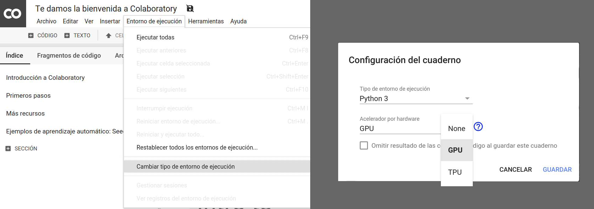

# Repositorio template para las ponencias del Programmathon 2020

 <br>
 <br>
 <br>
[](https://twitter.com/FerroRodolfo/) <br>
[](https://www.linkedin.com/in/rodolfoferro/) <br>
[](https://docs.google.com/presentation/d/e/2PACX-1vSTSwM0Mvf2Hr4CZzc__z7_Muaij3cHzpsq6B8qnM3FLlnUrpwk6NDN68LYRQt8BLjLqni1O8_3WXk8/pub?start=false&loop=false&delayms=3000)

Este repositorio de GitHub es una plantilla que contiene material (ejemplo) para un workshop dentro del [Programmathon 2020](https://quarantinehub.github.io/). Para utilizarlo en tu ponencia y subir tu material, ve a la siguiente sección. 

#### ¿Nunca has usado GitHub, Markdown o Jupyter/Google Colab?

Hay muchas guías en línea para usar estas tecnologías, algunas recomendaciones:
- GitHub: https://guides.github.com/activities/hello-world/.
- Markdown: https://guides.github.com/features/mastering-markdown/.
- Notebooks: 
  - Jupyter: https://jupyter.org/
  - Nbviewer: https://nbviewer.jupyter.org/github/jupyter/notebook/tree/master/docs/source/examples/Notebook/
  - Google Colab: https://colab.research.google.com
  - Azure notebooks: https://notebooks.azure.com/

**¿Tienes más dudas?** Escríbele a los organizadores o abre un [issue](https://help.github.com/en/articles/creating-an-issue).

## ¿Cómo usar esta plantilla para mi ponencia?

1. Crea tu propio [GitHub repo](https://help.github.com/en/articles/create-a-repo).
2. [Clona o descarga](https://help.github.com/en/articles/cloning-a-repository) este repo.
3. Copia los archivos de esta plantilla (que clonaste/descargaste en el paso anterior) a tu repo. **Puedes eliminar todos los archivos que no sean necesario (hay algunos de ejemplo).**
4. Edita y llena el repo con datos/código/notebooks y un README.md especifico para tu ponencia.

## Organización del repositorio

La estructura está inspirada en una versión lite de [cookie cutter data science project](https://drivendata.github.io/cookiecutter-data-science/):

- `data/`: Carpeta de datos para tu taller. Es recomendable enfocarse en un dataset o dos durante el workshop (ven lugar de varios), así los talleristas podrán profundizar en aspectos específicos de los datos y después enfocar su atención a la parte algorítmica/teoría del taller.
- `code/`: Conjunto de scripts y funciones de utilidad para usar en los notebooks.
- `notebook/`: Notebooks que se pueden lanzar en colab (o la plataforma que hayas definido). Enumera los notebook en orden de uso.
- `media/`: Imágenes, PDFs y demás material de media para usar en tus notebooks y repo.
- `environment.yml`: Archivos de configuración de entornos de Anaconda para crear tu entorno localmente.
- `README.md`: Archivo Markdown de entrada para la página y tu ponencia.

## ¿Sugerencias? ¿Mejoras?
Manda un [pull request](https://help.github.com/en/articles/about-pull-requests), lo evaluaremos, empezaremos una discusion y si es buena idea lo incorporaremos. :100:

## Instrucciones para asistentes

**_Las siguientes instrucciones se pueden copiar para tu ponencia._**

La mayoría de las sesiones prácticas se desarrollarán en Python 3.7+, por lo que a continuación te compartimos la manera en la que puedes preparar tu entorno.

Cosas para preparar:
- Una laptop.
- Este repositorio de GitHub clonado y actualizado antes de la ponencia.
- Un sentido aventurero en los datos y la programación.
- Un ambiente Python 3.7+ con Anaconda (ver opciones 1 y 2 abajo).

Las ponencias serán impartidocompartidass usando *notebooks* de Jupyter, documentos con código ejecutable, texto, ecuaciones, visualizaciones, imágenes y demás material. Los *notebooks* se pueden crear y ejecutar en la nube vía Google Colab (opción 1) o de manera local en tu computadora a través de [Jupyter Notebooks](https://jupyter.org/) usando Anaconda (opción 2).

### Opción 1: Google Colab

[Google Colab](https://colab.research.google.com) es un servicio de Google para ejecutar *notebooks* en la nube. Provee ambientes de Python 2 y 3 con CPUs, GPUs y TPUs. ¡Y es gratis! Sólo necesitas tener una cuenta de Google o crear una.

Recomendamos que elijas un ambiente con Python 3 y GPU para tu ponencia. Para activarlo:
- Abre el menú `Entorno de ejecución`
- Elige la opción `Restablecer todos los entornos de ejecución...`
- Vuelve a abrir `Entorno de ejecución`
- Elige `Cambiar tipo de entorno de ejecución`
- Selecciona Python 3 como `Tipo de ejecución` y GPU de la lista de `Acelerador por hardware`

La siguiente captura de pantalla ilustra este proceso.


En [Google Colab](https://colab.research.google.com) puedes crear un nuevo *notebook*, subir uno existente desde tu computadora o importarlo de Google Drive o GitHub.

### Opción 2: Ambiente local

Para tener la versión de Python 3.7+ y todas las bibliotecas instaladas en cualquier plataforma, recomendamos que uses [**Anaconda**](https://www.anaconda.com/) y generes un ambiente con el archivo `environment.yml` de este repositorio usando una terminal y el comando:

```
conda env create -n qhub -f environment_cpu.yml
```

Cambia el nombre `qhub` por tu nombre favorito para el ambiente. Si cuentas con un GPU Nvidia y deseas aprovecharlo cambia el archivo `environment_cpu.yml` a `environment_gpu.yml`.

Para activar el ambiente que creaste, en una terminal ingresa el comando

```
conda activate qhub
```

Una vez activado, puedes ejecutar la aplicación de Jupyter Notebook

```
jupyter notebook
```

Este comando abrirá una pestaña o ventana en tu navegador web, como se muestra en la siguiente captura de pantalla:


Al igual que en Google Colab, puedes crear un nuevo *notebook* seleccionando el botón `New` y posteriormente `Python 3`. De forma alternativa, puedes abrir uno existente seleccionando el archivo del *notebook* (con extensión `.ipynb`) dentro del directorio donde ejecutaste Jupyter Notebook. Con el botón `Upload` agregas archivos que se encuentran en otra parte de tu computadora a este directorio. Para cerrar Jupyter Notebook, presiona el botón `Quit` y posteriormente cierra la pestaña o ventana de tu navegador web.

Para desactivar el ambiente `qhub` de Anaconda simplemente ejecuta:
```
conda deactivate
```

## Atribuciones

Este repositorio está construido a partir de la plantilla creada para la Reunión Internacional de Inteligencia Artifical y sus Aplicaciones (RIIAA), que puedes encontrar [aquí](https://github.com/riiaa/riiaa19_workshop_template).
